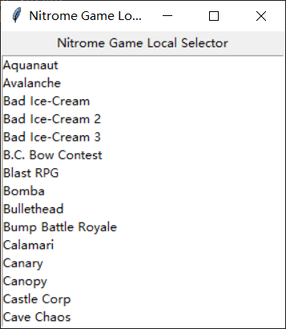

# Nitrome-Unlock-Local

## Introduction

We want to play **flash** games created by Nitrome, but when we saved these games, they became unavailable.

This is a tool to run Nitrome **flash** games **LOCALLY**.

I tried to use least external libraries.

简单来说就是让一部分Nitrome的游戏可以在本地运行。具体原理贴吧里有，可以搜一下下面的那个ID。

## Preparation

#### Fundamental preparation

* Install Python

* Download the official flash player, whose name can be 'flashplayer_sa.exe'

* Download .swf from www.nitrome.com , keep the origin file name, put into `download/`
  
  下载的游戏文件名不改，直接放到`download/`目录。

#### Configuration

Edit file `config.py`:

* Set `FLASH_EXE` as **path to flash player** 

* Add a record in `hosts` file (**This will block the website.**)
  
  `127.0.0.1 www.nitrome.com`

#### Play games

* Double click on `gui.py`, wait to download json file from `CPKaq/nitrome-game-launcher`

* If a game is **download** as in previous step, double click the item, and the game will launch.

## I used your results

渾濁の石灰氺, tieba.baidu.com

CPKaq, github.com

## Hint

You have no rights to redistribute this repository by your self.

You are not allowed to use the repository in any commercial activities.

I'm so sorry.
